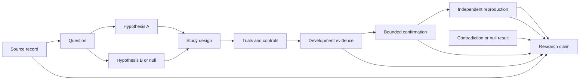

# Research Continuum architecture

Status: **architecture foundation accepted; narrow numerical 0.1 implementation in progress**. Owner: Lucas Santana. Foundation date: 2026-09-07. Acceptance evidence: [STATUS.md](STATUS.md).

## Product contract

Research Continuum is intended to be a local-first system for running bounded computational research programmes, primarily in general AI research. It should turn an explicit question into competing hypotheses, designed studies, inspectable trials, independent confirmation and a claim package whose support and limitations can be followed back to source and run evidence.

The system is not an autonomous scientist, a self-improving intelligence or a paper factory. An agent may propose a hypothesis, code change, search policy or interpretation. It cannot grant itself compute, widen its domain, reveal confirmation material, replace an evaluator, erase an outcome or promote its own prose to evidence. Better research-system policies are ordinary hypotheses evaluated on fresh campaigns under fixed budgets; there is no unbounded recursive improvement loop.

The first public 0.1 outcome is the owner-authorized trusted numerical comparison in decisions 001 and 002 below. The original tiny training-search/agent-versus-random programme remains a later outcome with its complete historical prerequisites.

## Inspected autoresearch baseline and proposed extension

[Karpathy's autoresearch](https://github.com/karpathy/autoresearch/tree/228791fb499afffb54b46200aca536f79142f117) is an inspiration and a comparison baseline, not a dependency, affiliation or inferior system. The official `master` inspected on 2026-09-07 resolved to `228791fb499afffb54b46200aca536f79142f117`.

| Concern | Inspected autoresearch baseline | Proposed Research Continuum extension |
| --- | --- | --- |
| Research unit | Repeated edits to one `train.py` | Versioned question, hypothesis, study, trial, evaluation, reproduction and claim objects |
| Domain | Simplified nanochat pretraining on one NVIDIA GPU | AI training first; later inference, retrieval, data research and non-LLM numerical optimization through explicit adapters |
| Search loop | Five-minute runs; lower `val_bpb` wins; keep, discard or crash | Predeclared baselines, controls, quality constraints, ablations, uncertainty and stop/pivot decisions |
| Mutable boundary | Agent edits `train.py`; `prepare.py` and evaluation are fixed by instruction | Candidate code runs in an untrusted workspace with evaluator code, confirmation data, credentials and campaign authority outside its trust domain |
| Evidence | `results.tsv`, run log and Git commits | Append-only lineage plus immutable completed bundles, partial-failure records, budget ledger and independent reproduction |
| Adaptation | Repeated validation-guided selection | Development search separated from bounded confirmation; repeated comparisons are accounted for by a study-specific statistical plan |
| Duration | The default programme instructs the loop to continue until interrupted | Every campaign, policy recursion and retry has a finite resource envelope and terminal decision |
| Output | A branch with retained training changes and an experiment log | Evidence package first; publication is a separately reviewed export and never automatic |

Autoresearch's compactness is part of its value: one editable file, one metric and a fixed per-trial wall-clock budget make the loop easy to inspect. Research Continuum should reproduce that observable baseline before claiming any extension is useful. Its official README says the current code requires Python 3.10+, `uv` and one NVIDIA GPU (tested on H100), and warns that results across different hardware are not directly comparable. Its README declares MIT; the inspected root did not expose a standalone license file, so exact reuse and attribution remain a Wave 1 licensing decision rather than an assumption.

## Research graph and contracts

The durable model is a directed, versioned evidence graph. Human-readable IDs are stable; revisions are new nodes or events rather than overwrites.



Required planned objects:

- `SourceRecord`: source ID, exact locator and version/date, authorship, license or terms, permitted transformations, redistribution rule, coverage, known limitations and retrieval evidence.
- `QuestionRevision`: bounded question, motivation, target population or workload, answer type, exclusions, decision relevance and stop condition.
- `HypothesisRevision`: predicted direction and magnitude when justified, mechanism, assumptions, supporting and contradicting sources, falsifier and parent question.
- `StudyDesign`: baseline and candidate arms, positive and negative controls, unit of analysis, sampling/seeds, metrics, quality constraints, ablations, search space, statistical family, uncertainty method, confirmation policy and resource envelope.
- `TrialSpec`: immutable accepted input to one execution, including adapter and policy versions, source/code/environment identities, parameters, seed, declared outputs and per-trial limits.
- `RunResult`: terminal or partial execution record, raw-artifact references, diagnostics, actual resources, environment/hardware, protocol deviations and lineage.
- `EvaluationRecord`: evaluator version, evidence partition, valid/invalid decision, metrics and units, comparison method, correction or justification, uncertainty and remaining alternatives.
- `ReproductionRecord`: independently prepared environment, inputs, deviations, result and whether the claimed observation was obtained within its declared tolerance.
- `ResearchClaim`: one precise statement linked to supporting, contradicting and missing evidence; applicability, limitations, status and reviewer disposition.
- `PublicationBundle`: claim set, study protocol, complete outcome table including negative and failed trials, artifact inventory, reproduction instructions, rights record and human approval. It is an export, not the research database.

Relationships such as `derived_from`, `tests`, `supports`, `contradicts`, `uses_source`, `evaluated_by`, `reproduces` and `supersedes` are explicit edges. W3C PROV supplies a useful interchange vocabulary for entities, activities, agents and derivations; Research Continuum still needs stricter project-specific scientific semantics.

## Study design and evidence promotion

Each accepted study freezes the scientific decision boundary before candidate search:

1. State the question, null or comparison hypothesis, eligible domain and falsifier.
2. Define the transparent baseline, candidate search space, positive/negative controls and invariants.
3. Reserve budgets for calibration, exploration, confirmation and independent reproduction. Exploration cannot borrow the confirmation reserve.
4. Separate development data and feedback from confirmation cases before the first adaptive proposal.
5. Define the family of comparisons and a suitable error-control or estimation method before confirmation. A generic p-value threshold or automatic Benjamini–Hochberg step is not valid for every dependent, sequential or adaptive campaign.
6. Register primary metrics, quality constraints, invalid states, uncertainty reporting, minimum effect or decision threshold and stopping rule.
7. Run all accepted trials into the durable ledger. Crashes, null effects and regressions stay in the denominator appropriate to the design.
8. Promote a finalist only after untouched confirmation within the query budget, then require an independently prepared reproduction and planned ablations before a supported causal or mechanistic claim.

Adaptive development feedback is search evidence. It can rank proposals, but repeated selection makes that same evidence unsuitable as fresh confirmation. Protected confirmation is scarce: the evaluator discloses only the result allowed by the study protocol, counts every query and closes the partition when its budget is exhausted. If a confirmation result drives another change, that changed candidate requires a new declared confirmation plan or new reserved evidence.

A valid unfavorable result is retained as evidence against the candidate under the study conditions; for the first training study, higher `val_bpb` is unfavorable and lower is favorable. A valid no-effect estimate may be informative or inconclusive depending on its uncertainty and the predeclared decision threshold. Malformed output, inadequate evidence, evaluator failure or numerical invalidity is inconclusive rather than evidence for either arm. Replication means a distinct study against new data or conditions; reproduction means another party obtains the stated result using substantially the same artifacts and protocol. Documents use those terms explicitly rather than treating any rerun as both.

## Logical planes and trust boundaries

The eventual system separates authority even when all trusted services begin on one machine:

| Plane | Planned responsibility | Forbidden authority |
| --- | --- | --- |
| Research registry | Questions, hypotheses, study revisions, claim graph and source records | Running unaccepted code or rewriting historical evidence |
| Coordinator | Deterministic state transitions, leases, cancellation, resource reservation and recovery | Defining scientific truth, changing an accepted study or publishing |
| Proposal workspace | Read approved sources and development feedback; produce structured proposals and bounded candidate patches | Confirmation data/evaluator access, credentials, network by default, budget changes or direct registry writes |
| Execution worker | Materialize one accepted `TrialSpec`, run a pinned adapter and collect declared outputs | Interpreting a result, selecting itself, reaching unrelated files or launching unbounded children |
| Development evaluator | Validate outputs and return protocol-limited search feedback | Revealing confirmation cases or editing candidates |
| Confirmation evaluator | Score reserved cases in a distinct trust domain and enforce the query ledger | Serving as a proposal tool or exposing raw holdout material |
| Reproduction worker | Rebuild a selected bundle from declared inputs without producer conversation state | Repairing the candidate silently or inheriting producer caches |
| Report/exporter | Render graph-backed tables, claims, limitations and artifact inventory | Inventing claims, hiding trials or publishing without approval |

The boundary must be enforced by process identity, filesystem mounts and operating-system or container controls under a documented threat model. A prompt saying “do not read this file,” a hidden UI control or read-only permissions inside the same fully visible workspace is insufficient.

## Domain-adapter boundary

Adapters make one study contract executable without giving domain code policy authority. The proposed provider-neutral interface is conceptual until RC-003 establishes exact Python types:

```text
describe_capabilities() -> CapabilityRecord
validate_spec(study_revision, trial_spec) -> ValidationResult
prepare_inputs(source_records, trial_spec, input_dir) -> PreparedInputs
execute(prepared_inputs, candidate_dir, output_dir, limits) -> ProcessOutcome
collect(output_dir, declared_outputs) -> RawRunArtifacts
reproduce(run_bundle, clean_workspace, limits) -> ProcessOutcome
```

Evaluator adapters are separate and unavailable to producer workspaces:

```text
validate_run(run_bundle, evaluator_revision) -> ValidityDecision
score_development(valid_run, feedback_policy) -> DevelopmentFeedback
score_confirmation(valid_run, confirmation_lease) -> EvaluationRecord
compare(study_design, evaluation_records) -> StudyComparison
```

Every adapter declares supported operating systems and hardware, inputs/outputs, units, deterministic controls, dependency and network needs, resource meters, kill semantics, known nondeterminism, prohibited tasks and safe-loading rules. Unknown fields are rejected at execution boundaries.

| Adapter family | First credible scope | Required domain controls |
| --- | --- | --- |
| Training | Tiny language-model training baseline | Lawful corpus, pinned tokenizer/split, equal resource accounting, seeds, quality metric and hardware disclosure |
| Inference | Latency, memory or throughput optimization under fixed quality | Warmup and measurement protocol, device/software identity, tail latency, memory peaks and unchanged quality constraints |
| Retrieval | Index/retriever/reranker or query-policy experiments | Corpus/query rights, contamination checks, query-level split, relevance judgments and leakage-resistant holdout |
| Data research | Filtering, weighting or curriculum proposals | Dataset lineage, transformation audit, deduplication and contamination checks, subgroup/coverage limits and no private records |
| Numerical optimization | Non-LLM solver/algorithm comparisons | Known-answer cases, convergence/residual checks, justified tolerances, conditioning and invalid numerical states |

Generality is earned only when at least two materially different adapters satisfy the same portable contracts without hiding domain-specific validity inside generic scores.

## Durable campaign state, atomic results and recovery

The proposed campaign state machine is:

```text
DRAFT -> ACCEPTED -> ACTIVE -> {PAUSED, EXHAUSTED, STOPPED, COMPLETED}
                         \-> COMPROMISED
```

Each study and trial has its own append-only transition stream. A trial moves through `PROPOSED -> ACCEPTED -> QUEUED -> LEASED -> RUNNING -> COLLECTING -> EVALUATED`, with `REJECTED`, `INVALID`, `FAILED` and `CANCELLED` terminal alternatives. `EVALUATED` does not imply confirmed, reproduced or supported.

Start with one coordinator writer, Python standard-library contracts, a repository-local fixture, filesystem artifact bundles and SQLite only when durable scheduling requires indexed transactions. A completed bundle is staged in a run-specific temporary directory, validated against its declared outputs, flushed, then atomically renamed. The registry transaction refers to the published bundle only after the rename. Partial diagnostics move to a distinct partial bundle; they never masquerade as a completed result.

Run IDs are allocated before execution. Retries create attempts under the same logical trial and never overwrite a terminal attempt. Leases have an owner, expiry and fencing generation. On restart, the coordinator reconciles leases, live process identity, bundle state and resource observations before scheduling. Ambiguous resource consumption is charged conservatively until reviewed. Cancellation terminates the process tree, records the reason and observed cost, and preserves useful diagnostics.

Artifact digests may later protect intrinsic run-bundle integrity and detect mutation; they are not plan identities, approvals or scientific evidence. Human-readable study/trial IDs, source revisions and normal diffs remain the review surface.

Concurrency is a resource decision, not an agent-count target. A campaign declares maximum workers plus CPU, GPU, memory, disk, wall-clock, evaluator-query and agent-inference pools. Reservations are atomic; a worker starts only if all required pools can satisfy it. Confirmation and reproduction reserves cannot be consumed by exploration. Partial failure releases unused reservations while retaining observed consumption.

## Untrusted input and execution controls

Threat assumptions include malicious or malformed source text, model proposals, candidate code, datasets, serialized artifacts and evaluator-facing outputs. The local operator and reviewed coordinator are trusted initially; candidate processes are not. RC-002 must define the supported attacker capability before RC-004 claims containment.

Planned controls include:

- validate structured contracts before materializing files; keep natural-language proposals as data, not commands;
- use fresh bounded workspaces with explicit mounts and process argument arrays, no shell interpolation;
- deny outbound network by default during candidate execution; mediate approved downloads during input preparation and record them;
- mount no personal credentials, SSH agents, browser state, cloud metadata endpoints, coordinator database or unrelated home/workspace paths;
- pin dependencies and load weights/data through formats and settings that do not execute arbitrary remote code;
- cap CPU/GPU time, memory, disk, open files, subprocesses and output size; terminate the whole process tree on timeout;
- keep evaluator source, secrets and confirmation inputs in a distinct execution identity; expose a narrow authenticated protocol with query leases;
- validate outputs by schema, size, media type and safe parser before evaluation; treat logs and generated reports as untrusted text;
- make accepted records append-only to workers and audit evaluator/config revisions; fail closed on provenance or query-ledger ambiguity;
- test attempted path traversal, symlink escape, fork/process escape, network exfiltration, secret enumeration, evaluator probing and oversized/malformed output against the supported platform.

These are design requirements, not a current sandbox guarantee. Local subprocess isolation alone is not sufficient against hostile code. Remote workers remain out of scope until local containment, replay, cancellation and recovery have representative evidence.

## Allocation and stop/pivot policy

The first scheduler is intentionally legible. It reserves baseline, confirmation and reproduction resources, gives each accepted hypothesis a small exploration floor, then allocates remaining exploration by a versioned policy such as round-robin or fixed random search. More adaptive approaches, including successive halving or bandit allocation, are candidate research policies that must be compared with simple allocation on fresh campaigns. A development metric alone never authorizes more money, holdout access or a domain expansion.

Every campaign records finite ceilings for trials, wall time, CPU/GPU time, storage, evaluator queries, agent inference and monetary cost where applicable. It also records:

- `PASS`: the predeclared decision threshold survives confirmation and reproduction without violating quality constraints;
- `REDIRECT`: evidence changes the question, baseline or study design enough to create a reviewed revision;
- `DESCOPE`: retain the core question with a smaller domain, search space or adapter;
- `HOLD`: required rights, hardware, reviewer capacity or evaluator integrity is unavailable;
- `TERMINATE`: the question is no longer useful/safe, the budget is exhausted, provenance is unrecoverable or the evaluator is compromised.

Stop a trial on invalid inputs, limit breach, unsafe behavior or missing declared output. Stop the campaign on its hard budget, repeated infrastructure failures above its predeclared tolerance, confirmation exhaustion, evidence contamination, missing rights or out-of-domain work. Preserve the best-known valid candidate and all outcomes. Pivoting creates a new question or study revision; it does not rewrite a failed protocol after seeing results.

## Local-first implementation and scale gates

| Stage | Planned topology | Evidence required before promotion |
| --- | --- | --- |
| Foundation | Documents, JSON task DAG and standard-library validator | The authorized root accepts the architecture and the validator detects deliberately invalid plans |
| Local skeleton | One trusted coordinator, synthetic fixture, filesystem bundles, at most one worker | Restart/replay, terminal-state, partial-failure and budget-ledger tests pass without model/cloud dependencies |
| Protected local experiment | OS-enforced candidate workspace plus separate local evaluator identity | Representative tampering, exfiltration, cancellation and holdout-query tests fail closed; one known-answer control reproduces |
| Local parallel campaigns | Fixed process pool and explicit resource reservations | Duplicate prevention, fencing, oversubscription and crash-recovery tests pass; measured queue time justifies concurrency |
| Remote workers | Narrow job protocol, artifact transfer and separately provisioned worker identity | Sustained local workload, measured elapsed-time benefit, reproducible environment packaging, revocation and partition recovery; explicit hardware/spend approval |
| Public research preview | Exported evidence packages and local workbench | At least two distinct domains, independent reproduction, rights review, material safety defects resolved and exact release approval |

Do not add Kubernetes, a workflow framework, graph/vector database, hosted model provider or distributed object store until measured scale or reliability evidence names the limitation it solves. SQLite through the existing Python standard library is adopted for the numerical 0.1 in decision 002; server storage remains deferred. The first RC-001 packet is source and baseline analysis and requires no paid compute. Any autoresearch runtime reproduction waits for an approved compatible GPU route, dependency/license review and bounded data acquisition.

## Relationship to the six independent laboratories

Research Continuum is one of six separately buildable projects. It is mostly a general AI research-system project; it does not become a shared control plane for the others.

| Independent repository | Possible portable contract relationship | Boundary retained |
| --- | --- | --- |
| Research Continuum | Originates candidate schemas after real implementation | Owns no external lab's scientific validity or roadmap |
| Lean Model Lab | May exchange training/inference `StudyDesign`, `RunResult` and reproduction bundles | Maintains its own evaluators, performance/quality decisions and release evidence |
| Vital Rehearsal | May adopt provenance and experiment-bundle concepts for physiological simulation | Clinical/domain review and safety rules stay local; no treatment claims flow from generic contracts |
| Grid Horizons | May reuse scenario/run/result vocabulary for power-system simulations | Grid models, units, constraints and physical-action gates remain repository-owned |
| Earth Rehearsal | May exchange source/model/experiment records for environmental simulation | Environmental applicability, data rights and intervention review remain local |
| Civic Safelab | May reuse study/evidence structures for synthetic sensing experiments | Privacy, surveillance prohibitions, subgroup harms and public-sector authority remain local |

Interchange means versioned JSON schemas or exported bundles linked by documented versions. It does not mean a new monorepo, shared deployment, cross-repository database or required package dependency. Each project can copy and adapt a small schema under compatible terms while designs are unstable. Extract a shared library only after at least two independent implementations expose the same costly duplication and maintainers approve the governance and release burden.

## Decisions, alternatives and reopen conditions

- Choose an evidence graph plus append-only events over a mutable “latest answer” table. Reopen if graph traversal costs become material; do not add a graph database before measurements.
- Choose separate proposal, execution and evaluator trust zones over instruction-only separation. Reopen the mechanism after RC-002 threat modelling and platform evidence, while preserving the authority boundary.
- Choose explicit domain adapters over arbitrary script callbacks. Reopen interface details when the second materially different adapter proves which fields are truly portable.
- Choose simple allocation baselines and finite campaign states over recursive self-modifying orchestration. More adaptive policies enter as bounded experiments, not coordinator mutations.
- Choose evidence-package production before manuscript generation. A publication exporter is downstream of confirmed claims and human review; paper volume is never a research metric.
- Choose local-first execution over a hosted platform. Scale only at the named gates; cloud convenience alone is not evidence.

## Risks and nonclaims

The main design risks are overfitting to evaluator feedback, data contamination, false discovery through repeated search, irreproducible hardware-dependent performance, unsafe candidate execution, hidden resource costs, adapter contracts that erase domain validity, and infrastructure work displacing actual questions. The roadmap tests those risks in dependency order.

This architecture does not establish that agent-guided research beats random search, that any hypothesis is novel, that any result is scientifically valid, that isolation is secure, that adapters are general, or that the six laboratories integrate. The historical foundation contained no runtime. Current narrow implementation and evidence levels are recorded in STATUS.md; no agent runtime, weights, protected holdout, multi-domain validity or deployment is implied. Broader claims remain gated by the tasks and evidence in [ROADMAP.md](ROADMAP.md), [EXPERIMENTS.md](EXPERIMENTS.md) and [STATUS.md](STATUS.md).


## Owner-authorized numerical 0.1 decision path

[Decision 001](docs/decisions/001-numerical-study.md) freezes the exact question, objective, policies, seeds, quality threshold, feedback and falsifier before computation. [Decision 002](docs/decisions/002-durable-local-campaign.md) adopts a trusted built-in API, SQLite append-only attempt/evaluation records, conservative finite reserved debits, flock liveness, terminal reconciliation and atomic exports. This narrow path derives from RC-015 while leaving its adapter-generality obligation and RC-004/005 adversarial isolation unfulfilled. The original training/agent-search requirements above remain historical/future contracts.
