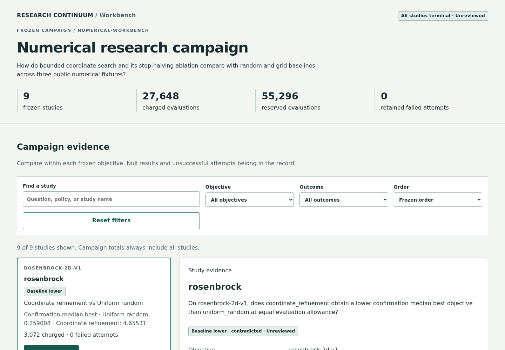
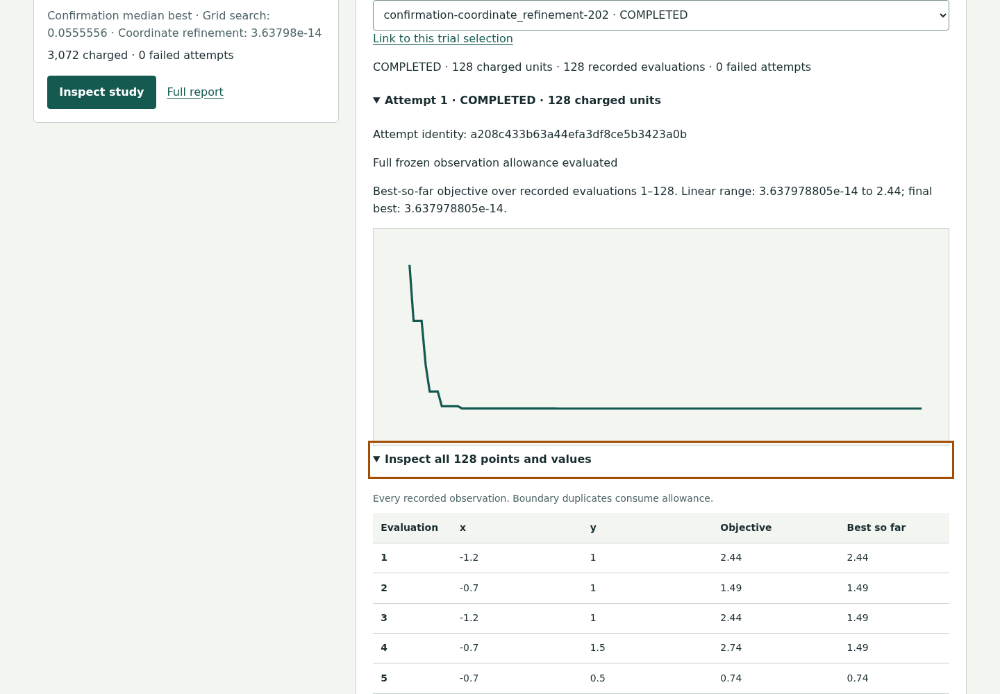
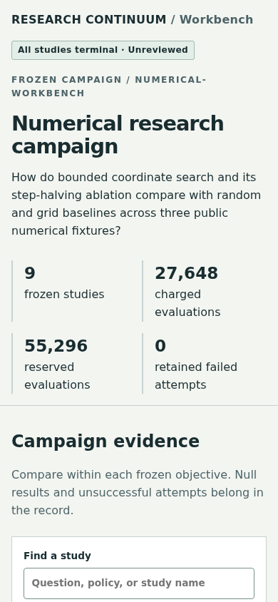
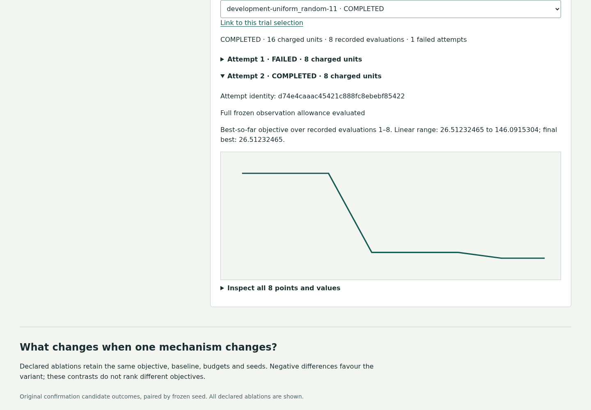

# Offline workbench design and accessibility observations

Scope: the packaged 0.5 campaign evidence browser, from campaign inventory to
selected study, trial, raw observations and retained failure. Observer: primary
GPT-6 Astra agent. All four screenshots below were opened and inspected before
acceptance. This is agent observation, not human accessibility validation.

1. **Campaign inventory — passes the tested flow.** The full inventory, cost totals,
   outcome filters and study reports are visible. Filtering changes the selected
   detail consistently; an empty result clears stale evidence. Campaign totals
   always retain the complete inventory.

   

2. **Trial and observation inspection — passes the tested flow.** Keyboard Enter
   expands the raw evidence; all 128 rows are present. The curve and its readable
   caption describe the selected attempt. A direct URL fragment restores the
   exact study/trial. The view is intentionally scrolled to the inspection section.

   

3. **Narrow overview — passes tested reflow.** The 390px screenshot retains the
   header, accounting labels and search entry. Separate DOM/keyboard checks cover
   320px width, 2× CSS zoom, reduced motion and horizontal table scrolling. CSS
   zoom is not a substitute for an actual browser-zoom or screen-reader user test.

   

4. **Failure and recovery — passes the tested flow.** The original failed attempt
   and completed retry stay visible, with 16 charged units and eight durable
   observations for this trial. The campaign's 136 charged units and ineligible
   ablation remain intact. The view is scrolled to this recovered trial.

   

The [machine-readable record](browser-verification.json) retains eleven asserted
interaction checks, three axe runs, actual colors/contrast ratios, screenshot
hashes and tool outputs. The tested states have zero automated accessibility
violations. Axe marked partially clipped horizontal-table cells for manual
contrast review; computed text/background ratios meet 4.5:1 and keyboard scrolling
reaches those columns. No claim of full WCAG compliance follows.

Remaining evidence gaps: independent human accessibility and qualified scientific
review; native macOS/Windows behavior; later live execution/stop interfaces outside
this read-only evidence browser. These are not represented as passed observations.
